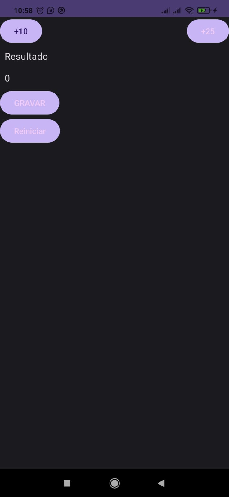

# Projeto simples Android Composable para explorar viewModel


## UI não autiliza quando estado do viewModel muda ? por isso esse projeto
Nos projetos do google eles fazer referência ao uiState de várias formas para cada unidade de treinamento.

Essa forma foi a mais simples (AppViewModel).
```kotlin
var uiState: AppUiState by mutableStateOf(AppUiState())
   private set
```

Uso do state no Composable
```kotlin
val uiState = appViewModel.uiState
...

Text(uiState.result.toString())
```

Porém atualizar internamente `result` dentro do viewModel não gera uma recomposição (atualização da tela). É **necessário** mudar a referência de uiState com os novos valores.

```kotlin
fun addTen() {
    uiState = uiState.copy(
        result = uiState.result + 10
    )
}
```
Dessa forma gera uma recomposição, atualização, na tela conforme o esperado.


### 

